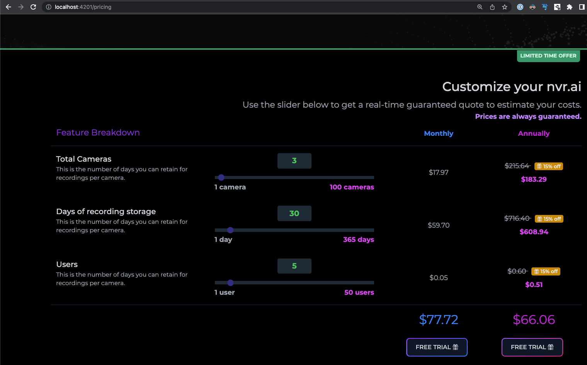

# Angular component library using Tailwindcss

Opinionated and customizable components for angular using tailwindcss.

> All components are standalone components and do not require
> importing via mododules.

## Components

| Syntax          | Description                      |
|-----------------|----------------------------------|
| @ngtw/accordion | Collapsible accordion component. |
| @ngtw/range     | Range input slider.              |

## Usage

Install the range component:

```bash
npm install @ngtw/range
```

Add the range component to your template:

```html

<ngtw-range labelClasses="text-green-500 bg-gray-800 p-1 px-6 rounded"
            inputClasses="h-2 accent-indigo-900 appearance-none bg-gray-800"
            textClasses="text-gray-600"
            [minLabel]="the mininmum!"
            minClasses="font-bold text-gray-400"
            [maxLabel]="the maximum!"
            maxClasses="font-bold text-fuchsia-500"
            [value]="50"
            [min]="1"
            [max]="100"
            (valueChange)="update(i, $event)"></ngtw-range>
```

Example implementation:


